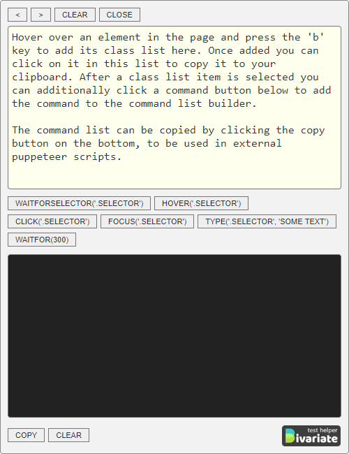
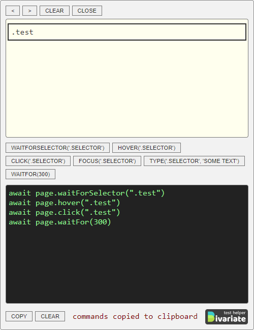

# Bivariate-test-helper
Chrome Extension - class list grabber / Puppeteer script generator

In browser tool to help gather class names and generate Puppeteer scripts for use in Bivariate `onBefore` & `onReady` scripts.
See Bivariate here: https://github.com/jparkerweb/Bivariate

